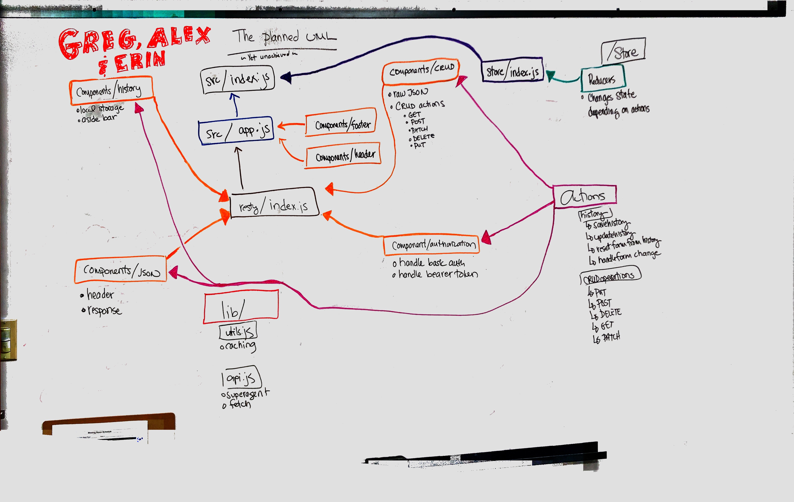

 PROJECT
=================================================
# RESTy Conversion to Redux

### Authors:
Erin, Greg, and Alex

### Links and Resources
* [GitHub Repository](https://github.com/resty-alex-greg-erin/RESTy-Revamp)

### What We Accomplished
#### State
* We set history and URL to a global state.
#### History
* We created initial state
* Rendered URL from history on click using Redux
#### Store
##### Actions
* Passed  `newState ` via `resortFormFromHistory()` to reducer on click
##### Reducers
* Changed state based on the `payload` that was passed as a result of the `GET` action.
### UML
 

